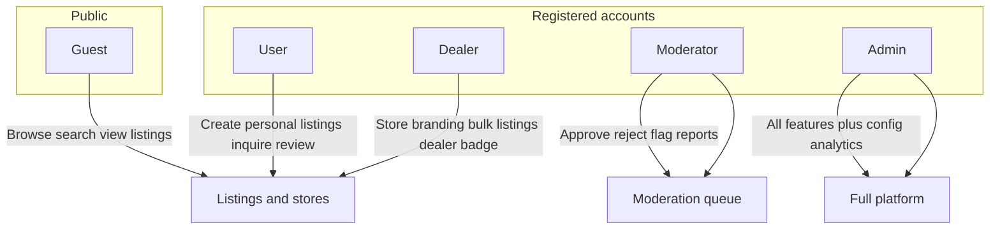
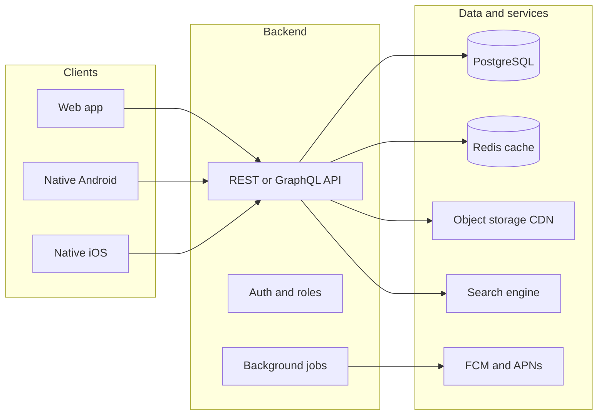

# Used Car Marketplace — Full Product & Technical Brief

## 1. Product vision

A **peer-to-peer and dealer marketplace** where individuals and verified dealers in **India** can list used cars, buyers can search/compare/inquire, and trust is built through **profile + store ratings/reviews**. The platform connects buyers and sellers; it does **not** need to handle the full car sale legally unless you later add payments/escrow.

**Primary surfaces:**
- **Website** — discovery, SEO, desktop listing management
- **Native Android app** (Google Play)
- **Native iOS app** (App Store)

**Explicit constraint:** No Capacitor/Cordova/WebView shells. Each mobile app is built with platform-native UI toolkits.

---

## 2. User roles and permissions

| Role | Can do | Cannot do |
|------|--------|-----------|
| **Guest** | Browse/search, view listings & public store pages, read reviews | Post listings, message sellers, write reviews |
| **User** | Everything guest + create/edit own listings, save favorites, message sellers/dealers, book test drives (if enabled), write reviews after verified interaction, report listings | Access dealer store admin, moderate content, platform settings |
| **Dealer** | Everything user + **dealer store** (logo, banner, description, contact hours, location), unlimited/higher listing quota, featured placement (if paid), dealer analytics dashboard, team members (optional) | Moderate others' content, change platform rules |
| **Moderator** | Review pending/flagged listings & reviews, suspend listings, warn/ban users (within policy), handle abuse reports, verify dealer documents (if workflow enabled) | Change pricing/plans, delete admin accounts, full financial config |
| **Admin** | Full control: roles, categories, regions, monetization toggles, featured slots, system config, audit logs, bulk actions, analytics | — |

**Account model recommendation:** One login identity with a **role flag** (and optional upgrade path: User → Dealer after verification). Dealers retain a linked **store entity** separate from their personal profile.

---

## 3. Core features you described (expanded)

### 3.1 Listings (individual + dealer)

Each listing should support:

**Vehicle identity**
- Make, model, variant/trim, manufacturing year, registration year
- Body type (hatchback, sedan, SUV, etc.)
- Fuel type (Petrol, Diesel, CNG, EV, hybrid)
- Transmission (Manual, Automatic, AMT, DCT)
- Engine capacity, power (optional), seating

**Condition & history**
- Odometer reading (km) with **photo of odometer** (anti-fraud)
- Number of owners (1st, 2nd, 3rd+)
- Accident/flood history (self-declared + optional inspection report upload)
- Service history available (yes/no + document upload)
- Tyre condition, spare key, spare tyre

**Legal / India-specific**
- Registration state & RTO city
- Registration number (masked in public view: e.g. `MH12 XX 1234` → `MH12 XX ****` until buyer inquiry)
- RC status (valid / pending transfer)
- Insurance type & expiry date
- Pollution certificate (PUC) validity
- Hypothecation / loan status (loan cleared / loan ongoing — affects transfer)
- FASTag, RC book type (original/duplicate)

**Pricing & sale terms**
- Asking price (₹), negotiable flag
- Price history (optional, for transparency)
- Exchange accepted (yes/no)
- Reason for selling (optional)

**Media**
- **Minimum 5 photos**, recommended 10–15: exterior (4 angles), interior, dashboard/odometer, engine bay, tyres, RC/insurance (watermarked or blurred sensitive fields)
- Optional **360° exterior** or short **video walkaround** (Phase 2)
- Image order + cover photo

**Location & availability**
- City, locality/pincode (map pin optional)
- Available for test drive (yes/no + preferred slots)
- Listing status: draft → pending review → live → sold → expired → removed

**Seller attribution**
- Listed by **individual** or **dealer store**
- Dealer badge on dealer listings

### 3.2 Search & discovery

- Text search (make, model, keyword)
- Filters: price range, year, km, fuel, transmission, body type, owners, city/state, seller type (individual/dealer), verified only, with photos, price drop, newly listed
- Sort: relevance, price low/high, newest, lowest km, nearest (requires location permission)
- **Saved searches** + alerts (push/email when new match)
- Compare up to 3–4 cars side-by-side (website especially)

### 3.3 Dealer stores

- Store name, slug URL (`/dealer/sharma-motors-mumbai`)
- Logo, cover banner, about text, brands specialization
- Address, map, phone, WhatsApp (optional), business hours
- **Store rating** aggregate + review list
- All live inventory under store tab
- Optional: "Certified pre-owned" or "Inspected" badge (if you add inspection partners later)

### 3.4 Ratings & reviews

Two review targets:
1. **Seller profile** (individual user)
2. **Dealer store**

**Trust rules (important):**
- Only users with a **verified interaction** can review (e.g. inquiry marked complete, test drive logged, or sale marked — pick one policy and stick to it)
- Star rating (1–5) + text + optional tags ("Honest description", "Smooth transfer", "Hidden defects")
- Seller/dealer **one reply** per review
- Report review → moderator queue
- Moderators can hide abusive/fake reviews

### 3.5 Messaging & leads

- In-app chat or structured **inquiry form** (name, message, preferred call time)
- Share listing link in chat
- **Do not expose phone/email publicly** until seller opts in (reduces spam)
- Lead inbox for sellers/dealers with read/unread, archive
- Optional WhatsApp deep link (popular in India) with seller consent

---

## 4. Features you likely missed (add to brief)

### 4.1 Trust & safety
- **Phone OTP verification** at signup (India standard)
- **Email verification**
- Dealer **KYC**: GSTIN, trade license, PAN, address proof — manual or third-party verification
- **Listing moderation**: new listings (and edits to price/photos) go to queue or auto-publish with post-review
- **Report listing** reasons: scam, wrong info, duplicate, offensive, already sold
- **Block user** / mute
- **Fraud signals**: duplicate images across listings, price too low, rapid reposting
- Optional **vehicle history report** integration (Phase 2+)

### 4.2 User account features
- Profile photo, display name, city, member since
- My listings (active, pending, sold, expired)
- Favorites / wishlist
- Recently viewed
- Notification preferences
- Delete account (App Store / Play requirement + DPDP compliance)

### 4.3 Listing lifecycle
- Draft save, preview before publish
- **Expiry** (e.g. 60–90 days) with renew reminder
- Mark as sold (prompt for optional review)
- Bump/refresh listing (monetization hook)
- Duplicate listing from existing

### 4.4 Notifications
- Push (FCM + APNs): new message, price drop on saved search, listing approved/rejected, review received
- Email/SMS for critical events (optional)

### 4.5 Content & SEO (website)
- Public listing URLs indexed by Google
- City/make/model landing pages ("Used Swift in Pune")
- Structured data (Schema.org `Car`, `AutoDealer`) for rich snippets
- Sitemap, robots, canonical URLs

### 4.6 Legal & compliance (India)
- Terms of Service, Privacy Policy, Cookie policy
- **DPDP Act 2023** alignment: consent, data minimization, grievance officer, data export/delete
- Disclaimer: platform is **intermediary**, not party to sale; users responsible for RC transfer, RTO, loan closure
- Content takedown process
- Age gate if required (18+)
- Consumer Protection (e-commerce) rules if you take payments later

### 4.7 Accessibility & languages
- English + **Hindi** at minimum (Phase 2: regional languages)
- WCAG-friendly web; TalkBack/VoiceOver labels on mobile

### 4.8 Support
- Help center / FAQ (how to transfer RC, what documents to check)
- Contact support form
- Admin-visible ticket log

### 4.9 Analytics (admin)
- Listings created, conversion to inquiry, DAU/MAU
- Top searches, popular models, dealer performance
- Moderation SLA metrics

---

## 5. Monetization options (undecided — include all in roadmap)

| Model | Description | Complexity |
|-------|-------------|------------|
| **Free + ads** | Banner/native ads on listing pages | Low |
| **Featured listings** | Pay to pin/top of search | Medium |
| **Dealer subscription** | Monthly plan for store + N listings + analytics | Medium |
| **Pay-per-listing** | Individual users pay after 1 free listing | Medium |
| **Lead fee** | Charge dealers per qualified lead | Medium |
| **Inspection partnership** | Revenue share with inspection garages | High |
| **Escrow/booking** | Token amount via Razorpay/PayU — **heavy legal/KYC** | High |

**Recommendation for v1:** Launch **free connect-only** with optional **featured listing** and **dealer subscription** toggled off until product-market fit. Avoid in-app sale payments until legal review.

---

## 6. Technical architecture

### 6.1 Recommended stack (opinionated starting point)

| Layer | Choice | Why |
|-------|--------|-----|
| **Backend API** | Python FastAPI or Node NestJS | Mature auth, file upload, admin APIs |
| **Database** | PostgreSQL | Relational data: users, listings, reviews, roles |
| **Cache / sessions** | Redis | Sessions, rate limits, job queues |
| **Search** | PostgreSQL full-text v1 → **Meilisearch/Elasticsearch** v2 | Faceted car search at scale |
| **Images** | S3-compatible storage + CDN (Cloudflare R2 / AWS S3 + CloudFront) | Multiple photos per listing |
| **Web** | Next.js (React) or Nuxt | SEO, SSR listing pages |
| **Android** | **Kotlin + Jetpack Compose** | Native, Play policy friendly |
| **iOS** | **Swift + SwiftUI** | Native, App Store standard |
| **Push** | Firebase Cloud Messaging + APNs via FCM | One pipeline for both |
| **Maps** | Google Maps SDK (India coverage) | Dealer location, nearby search |
| **SMS OTP** | MSG91 / Twilio / AWS SNS | India delivery |
| **Email** | Resend / SES | Verification, alerts |

**Shared contract:** OpenAPI spec generated from backend; mobile teams consume the same API version as web.

### 6.2 Native apps — what to build (not wrappers)

Each app needs **native** implementation of:
- Onboarding, OTP login, biometric unlock (optional)
- Listing feed with native scrolling, image galleries, pinch-zoom
- Camera/gallery upload with compression before upload
- Push notification handling (deep links to listing/chat)
- Maps for dealer location
- Offline-friendly favorites cache (read-only)

**Code sharing strategy:** Share **API models and business rules** via OpenAPI-generated clients (Kotlin Swift generators), not shared UI. Optional: shared **design tokens** (colors, spacing) as JSON — not a WebView.

### 6.3 Image pipeline
- Client uploads to **presigned URL** (direct to storage)
- Server generates thumbnails (webp/jpeg)
- Max file size, virus scan optional
- EXIF strip for privacy (GPS removal)
- Watermark optional for dealer branding

### 6.4 API design highlights
- Versioned: `/api/v1/...`
- JWT or opaque session tokens + refresh
- Role claims in token or server-side session lookup
- Pagination, rate limiting on search and OTP
- Webhook endpoints for payment provider (future)

---

## 7. Data model (high level)

**Entities:** `User`, `DealerStore`, `Listing`, `ListingImage`, `Review`, `ReviewTarget` (user/store), `Message`/`Inquiry`, `Favorite`, `SavedSearch`, `Report`, `ModerationAction`, `DealerDocument`, `Notification`, `AuditLog`

**Key relationships:**
- User 1—1 optional DealerStore
- DealerStore 1—many Listings
- User 1—many Listings (individual)
- Listing many Images
- Review polymorphic → User or DealerStore

---

## 8. Moderation & admin workflows

1. User/dealer submits listing → **pending** (or auto-live with AI/image checks later)
2. Moderator approves/rejects with reason → seller notified
3. User reports listing → ticket in queue
4. Admin configures: auto-approve trusted dealers, banned words, max photos
5. All moderator/admin actions → **audit log** (who, what, when)

**Admin dashboard (web only is fine):** user search, listing bulk actions, dealer verification queue, review disputes, platform stats, feature flags.

---

## 9. App Store & Play Store requirements

### Both stores
- Privacy policy URL (hosted on website)
- Account deletion flow in-app
- Accurate app description, screenshots per device size
- Content rating questionnaire (likely **Everyone** or **Teen** — no user-generated car photos of people as focus)
- Handle **user-generated content**: report mechanism + moderation (Apple Guideline 1.2)

### Google Play
- Data safety form (what you collect: phone, location, photos)
- Target API level compliance
- 64-bit native builds

### Apple App Store
- App Privacy Nutrition Labels
- Sign in with Apple **if** you offer Google/social login (Apple rule)
- Photo library / camera usage strings in Info.plist
- Location permission justification strings

### Deep linking
- Universal Links (iOS) + App Links (Android) for `yourdomain.com/listing/{id}` opening in app when installed

---

## 10. Non-functional requirements

| Area | Target |
|------|--------|
| **Uptime** | 99.5% v1 |
| **Listing search** | under 500ms p95 (with cache) |
| **Image upload** | Progress UI; retry on failure |
| **Security** | HTTPS only, bcrypt/argon2 passwords, OWASP top 10, rate-limited OTP |
| **Backups** | Daily DB backup, 30-day retention |
| **Scalability** | Stateless API behind load balancer; storage external |
| **Logging** | Structured logs, no PII in plain text |

---

## 11. Suggested delivery phases

### Phase 0 — Foundation (4–6 weeks)
- Auth (OTP), roles, basic user/dealer profiles
- Listing CRUD + multi-image upload
- Public search (basic filters)
- Website listing pages (SEO)

### Phase 1 — Marketplace MVP (6–8 weeks)
- Dealer store pages
- Messaging/inquiries
- Reviews (post-interaction)
- Moderation queue + admin basics
- Native Android + iOS: browse, search, listing detail, post listing, chat

### Phase 2 — Growth (ongoing)
- Saved search alerts, compare, featured listings
- Dealer subscriptions (Razorpay)
- Hindi UI, inspection partners
- Advanced search (Meilisearch), analytics dashboard

### Phase 3 — Optional commerce
- Token booking / escrow (legal + payment gateway KYC)

---

## 12. Team & deliverables checklist

**Roles needed:** Product owner, UI/UX designer, backend engineer, web frontend, **Android developer**, **iOS developer**, QA, DevOps (part-time), legal reviewer (Terms/Privacy)

**Documentation to produce before build:**
- PRD (this brief refined)
- User flows (Figma)
- OpenAPI spec v1
- Database schema ERD
- Moderation policy document
- Brand guidelines (for dealer store theming limits)

**Separate repositories recommended:**
- `car-market-api` (backend)
- `car-market-web`
- `car-market-android`
- `car-market-ios`

---

## 13. Open decisions for you (before development starts)

1. **Moderation default:** auto-publish vs manual approve for all new listings?
2. **Phone exposure:** hide until inquiry accepted, or show for dealers only?
3. **Inspection:** self-declared only at launch, or partner with a garage chain?
4. **Brand name & domain** — needed for store listings, email, deep links
5. **Monetization pick** from Section if any paid feature in v1

---

## Summary

This brief covers your core ask (search, individual + dealer listings, store branding, ratings, rich car details, multi-image, four roles) plus the usual marketplace essentials: **OTP auth, messaging, moderation, fraud reporting, listing lifecycle, push alerts, SEO web, India-specific vehicle/RTO fields, DPDP/legal, native mobile architecture (Kotlin/Swift), and store compliance**. Monetization stays flexible with clear options for later phases.

**This is a greenfield project** — separate from your existing Trading Nexus codebase. When you approve direction, the next step is a detailed PRD + wireframes + API schema before any code is written.
