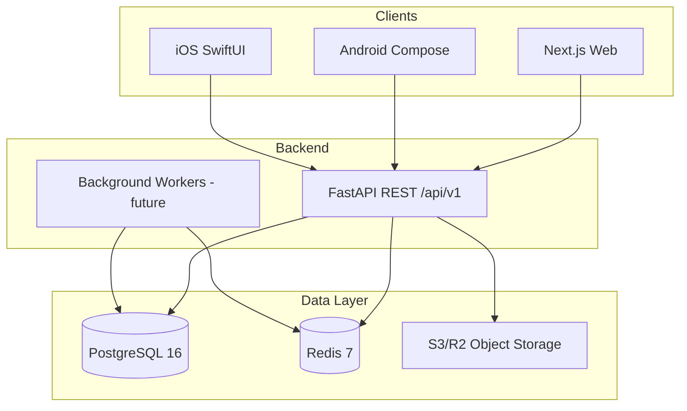

# Architecture

## System context



## API layers (Clean Architecture)

```
api/app/
├── domain/           # Entities, enums, repository interfaces
├── application/      # Use cases / services (business logic)
├── infrastructure/   # SQLAlchemy repos, Redis, SMS, storage adapters
├── api/v1/           # FastAPI routers, request/response schemas
└── core/             # Config, security, logging, dependencies
```

**Dependency rule:** outer layers depend on inner; domain has zero infrastructure imports.

## Authentication flow

1. Client `POST /api/v1/auth/otp/request` with phone → SMS sent (mock in dev)
2. Client `POST /api/v1/auth/otp/verify` with phone + OTP → access + refresh JWT
3. Access token in `Authorization: Bearer`; refresh via `POST /api/v1/auth/refresh`
4. Role claims in JWT; fine-grained checks in route dependencies

## Listing lifecycle

```
draft → pending_review → live → sold | expired | removed
```

Moderation (interim default): new publishes go to `pending_review`.

## Search (v1)

PostgreSQL:
- B-tree indexes on price, year, km, city, fuel, transmission, body_type, status
- `tsvector` column on make/model/variant for full-text search
- Pagination via cursor or offset (offset for v1 simplicity)

## Image pipeline (planned)

1. Client requests presigned URL from API
2. Client uploads directly to S3/R2
3. Client confirms upload → API creates `listing_images` row
4. Worker generates thumbnails (Phase 0 completion)

## Deployment topology (production target)

- API: containerized behind load balancer (Fly.io / AWS ECS / Railway)
- Web: Vercel or container SSR
- DB: managed PostgreSQL (RDS / Supabase / Neon)
- Redis: managed (ElastiCache / Upstash)
- Storage: Cloudflare R2 + CDN
- CI/CD: GitHub Actions → staging → production

See [DEPLOYMENT.md](DEPLOYMENT.md) for environment variables and checklist.
