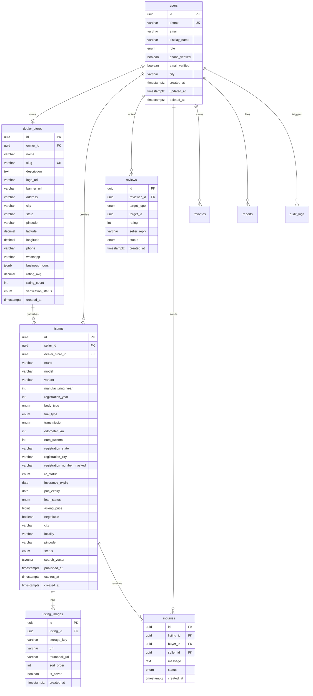

# Database Schema

PostgreSQL 16. Migrations managed by Alembic in `api/alembic/`.

## ER diagram (core entities)

## Indexes

| Table | Index | Purpose |
|-------|-------|---------|
| `listings` | `(status, city)` | Active listings by city |
| `listings` | `(asking_price)` | Price sort/filter |
| `listings` | `(manufacturing_year)` | Year filter |
| `listings` | `(odometer_km)` | KM filter/sort |
| `listings` | `GIN(search_vector)` | Full-text search |
| `users` | `(phone)` UNIQUE | Login lookup |
| `dealer_stores` | `(slug)` UNIQUE | Public URL |
| `listing_images` | `(listing_id, sort_order)` | Gallery order |

## Enums

- `user_role`: guest, user, dealer, moderator, admin
- `listing_status`: draft, pending_review, live, sold, expired, removed
- `fuel_type`: petrol, diesel, cng, ev, hybrid
- `transmission`: manual, automatic, amt, dct
- `body_type`: hatchback, sedan, suv, muv, coupe, convertible, pickup, van
- `rc_status`: valid, pending_transfer
- `loan_status`: cleared, ongoing
- `verification_status`: pending, verified, rejected

## Constraints

- Listing requires minimum fields before `publish` (enforced in application layer)
- Soft delete on `users` via `deleted_at`
- Registration number stored encrypted/masked; never full number in public API

## Backup policy (production)

- Daily automated PostgreSQL backup
- 30-day retention
- Point-in-time recovery enabled on managed provider
